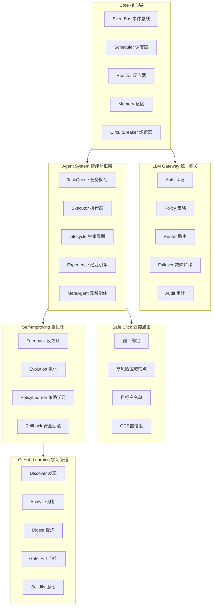

<p align="center">
  
</p>

<h1 align="center">TaijiOS 太极OS</h1>

<p align="center">
  融合易经哲学的自学型 AI 操作系统<br>
  <em>A self-learning AI operating system inspired by I Ching philosophy</em>
</p>

<p align="center">
  <a href="LICENSE"></a>
  <a href="https://github.com/yangfei222666-9/taiji/stargazers"></a>
  <a href="https://github.com/yangfei222666-9/taiji/issues"></a>
</p>

<p align="center">
  <a href="#architecture-架构">架构</a> · <a href="#features-核心能力">能力</a> · <a href="#quick-start-快速开始">快速开始</a> · <a href="#modules-模块">模块</a> · <a href="#contributing-贡献">贡献</a>
</p>

---

> 这个项目由一个不会写代码的人，用多 AI 协作搭建而成。
>
> This project was built by a non-programmer through multi-AI collaboration.

---

## Architecture 架构



## Features 核心能力

| 能力 | 说明 | Status |
|------|------|--------|
| Event-Driven Core 事件驱动核心 | EventBus + Scheduler + Reactor，所有行为由事件触发 | ✅ |
| LLM Gateway 统一网关 | 认证、限流、多 Provider 故障转移、审计，12/12 极端场景通过 | ✅ |
| Agent System 智能体框架 | 任务队列（原子状态转换）、生命周期管理、经验收割 | ✅ |
| MetaAgent 元智能体 | 自动检测系统缺口 → 设计新 Agent → 沙箱测试 → 动态注册 | ✅ |
| Self-Improving Loop 自进化环 | 反馈环 + 进化评分 + 策略学习 + 安全回滚 | ✅ |
| Circuit Breaker 熔断器 | 故障隔离，防止级联崩溃 | ✅ |
| Safe Click 受控点击 | 四闸门安全点击执行器（窗口绑定 + 区域禁点 + 白名单 + OCR 置信度） | ✅ |
| GitHub Learning 学习管道 | 从开源项目学习：发现 → 分析 → 提炼 → 人工门控 → 固化 | ✅ |
| Match Analysis 赔率交叉验证 | 多数据源比赛分析 + 赔率交叉验证框架 | ✅ |
| Skill Auto-Creation 技能自动创建 | 从日志检测可重复模式 → 生成技能草案 → 三层验证 | 🔄 |
| Pattern Recognition 模式识别 | 从运行数据中识别可优化模式 | ✅ |

## Tech Stack 技术栈

```
Python 3.12 · FastAPI · SQLite · pyautogui · edge-tts · Whisper
```

## Quick Start 快速开始

```bash
# 克隆项目
git clone https://github.com/yangfei222666-9/TaijiOS.git
cd TaijiOS

# 安装依赖
pip install -e .

# 运行最小示例（无需 API Key、无需 GPU）
python examples/quickstart_minimal.py
```

你会看到：

```
--- Task: quickstart-001 ---
  Status: succeeded
  Attempts: 2
  Final score: 0.9
  Self-healed: YES

  Results: 3/3 succeeded
  Self-healed: 3/3
  Events logged: 18
```

发生了什么：3 个任务进入系统 → 首次验证失败(0.35) → 自动注入修复指导 → 重试成功(0.90) → 生成证据链。

这就是太极OS的核心循环：**任务 → 验证 → 失败 → 指导 → 重试 → 交付 → 证据**。

### 启动 LLM Gateway

```bash
export TAIJIOS_GATEWAY_ENABLED=1
python -m aios.gateway --port 9200
```

### 启动 GitHub 学习管道

```bash
export GITHUB_TOKEN=your-github-token
python -m github_learning discover --limit 10
python -m github_learning analyze
python -m github_learning digest
python -m github_learning gate list
python -m github_learning gate approve <id>
python -m github_learning solidify
```

## Modules 模块

```
TaijiOS/
├── aios/
│   ├── core/              # 事件引擎、调度器、反应器、记忆、熔断器、Safe Click
│   ├── gateway/           # LLM 统一网关（认证、路由、故障转移、审计）
│   ├── agent_system/      # 智能体框架（任务队列、执行器、经验引擎、元智能体）
│   └── storage/           # SQLite 存储层
├── self_improving_loop/   # 自进化环（反馈、进化、策略学习、回滚）
├── github_learning/       # GitHub 学习管道（发现→分析→提炼→门控→固化）
├── match_analysis/        # 赔率交叉验证框架
├── rpa_vision/            # Safe Click 受控点击验证器
├── skill_auto_creation/   # 技能自动创建（检测→草案→验证→反馈→注册）
├── examples/              # 快速开始示例
├── tests/                 # 测试套件
└── docs/                  # 架构文档
```

| Module | Description | 说明 |
|--------|-------------|------|
| `aios/core/` | Event engine, scheduler, reactor, memory, circuit breaker, model router, Safe Click | 事件引擎、调度器、反应器、记忆、熔断器、模型路由、安全点击 |
| `aios/gateway/` | Unified LLM Gateway — auth, rate limiting, provider failover, audit, streaming | 统一 LLM 网关 — 认证、限流、故障转移、审计、流式传输 |
| `aios/agent_system/` | Task queue, agent lifecycle, experience harvesting, meta-agent, evolution | 任务队列、智能体生命周期、经验收割、元智能体、进化 |
| `self_improving_loop/` | Safe self-modification with rollback and threshold gates | 安全自修改 + 回滚 + 阈值门控 |
| `github_learning/` | Learn from GitHub: discover, analyze, digest, gate, solidify | 从 GitHub 学习：发现、分析、提炼、门控、固化 |
| `match_analysis/` | Multi-source match analysis with odds cross-validation | 多数据源比赛分析 + 赔率交叉验证 |
| `rpa_vision/` | Safe Click validator — 4-gate controlled click executor | 安全点击验证器 — 四闸门受控点击执行器 |
| `skill_auto_creation/` | Auto-detect patterns → draft skills → 3-layer validation | 自动检测模式 → 生成技能草案 → 三层验证 |

## Configuration 配置

所有敏感信息通过环境变量配置：

```bash
# LLM Gateway
export TAIJIOS_GATEWAY_ENABLED=1
export TAIJIOS_API_TOKEN=your-token

# GitHub Learning
export GITHUB_TOKEN=your-github-token

# Optional: Telegram notifications
export TAIJI_TELEGRAM_BOT_TOKEN=your-bot-token
export TAIJI_TELEGRAM_CHAT_ID=your-chat-id
```

## Design Principles 设计原则

| Principle | 原则 | Description |
|-----------|------|-------------|
| Self-healing | 自愈优先 | 验证失败自动重试，注入修复指导 |
| Experience-driven | 经验驱动 | 每次执行产生经验数据，改进未来运行 |
| Gate everything | 门控一切 | 外部机制经人工审核后才进入主线 |
| Evidence-first | 证据先行 | 每个决策、失败、恢复都有结构化证据 |
| Graceful degradation | 优雅降级 | 组件降级到兜底方案，永不崩溃系统 |
| Default deny | 默认拒绝 | Safe Click 四闸门全过才允许执行 |

## Screenshots 截图

<p align="center">
  
</p>

Dashboard 展示了完整的任务执行流：提交 → 验证 → 卦象决策 → 交付，包含四维检查评分和执行轨迹。

## Private Modules 私有模块

以下模块由合作伙伴提供，未包含在开源版本中：

| 模块 | 说明 | 状态 |
|------|------|------|
| 神针引擎 | 高精度决策引擎 | 🔒 私有 |
| EchoCore 智驱系统 | 智能驱动核心 | 🔒 私有 |

相关接口已预留抽象基类，开发者可自行实现替代方案。

## Contributing 贡献

详见 [CONTRIBUTING.md](CONTRIBUTING.md)。

## License

[Apache License 2.0](LICENSE)

---

<p align="center">
  <strong>太极生两仪，两仪生四象，四象生万物。</strong><br>
  <em>From Taiji comes Yin and Yang; from Yin and Yang come all things.</em>
</p>
