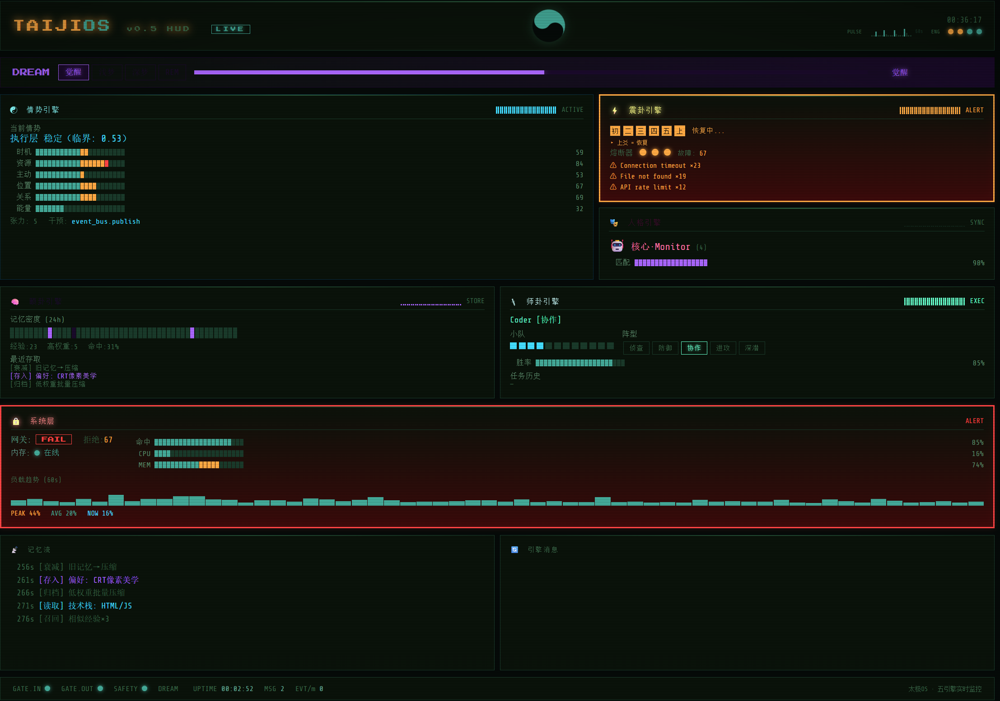
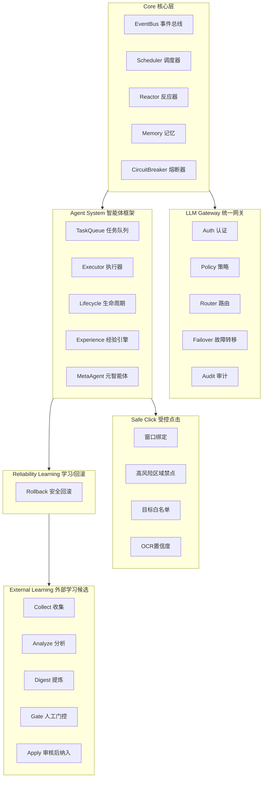
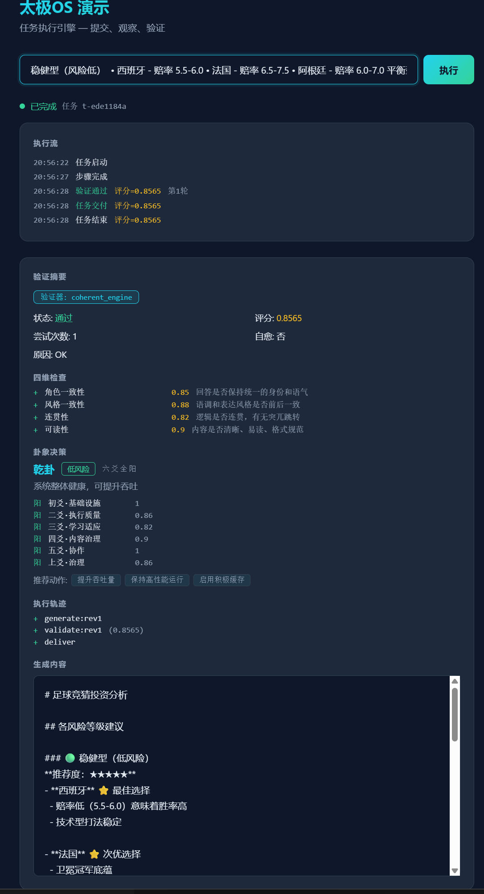

<p align="center">
  
</p>

<h1 align="center">Agent Reliability Evidence</h1>

<p align="center">
  TaijiOS 太极OS: evidence-first reliability work for coding agents<br>
  <em>False-pass prevention, scoped failure-mode research, and explicit no-overclaim boundaries</em><br>
  <strong>Agent said done. Where is the evidence?</strong>
</p>

<p align="center">
  <a href="https://github.com/yangfei222666-9/taiji/actions/workflows/ci.yml"></a>
  <a href="LICENSE"></a>
  <a href="https://github.com/yangfei222666-9/taiji/stargazers"></a>
  <a href="https://github.com/yangfei222666-9/taiji/issues"></a>
</p>

<p align="center">
  <a href="#public-entry-公开入口">Public proof</a> · <a href="docs/portfolio/agent-reliability-proof.md">False-Pass Gate</a> · <a href="docs/research/codex-reliability-gap-map-01.md">Gap Map</a> · <a href="#quick-start-快速开始">Quick Start</a>
</p>

---

## Public entry 公开入口

This repository is the public Agent Reliability entrypoint for TaijiOS. It shows how I inspect AI-agent "done" claims, map coding-agent failure reports to evidence gates, and separate local checks, remote CI, provider output, and canonical truth.

- Agent Reliability proof path: Agent said done. Where is the evidence?
  - Implementation proof: [False-Pass Gate](docs/portfolio/agent-reliability-proof.md) and `python3 scripts/check_false_pass_gate.py --self-test examples/false_pass_gate/fixtures`.
  - Research proof: [Codex Reliability Gap Map #01](docs/research/codex-reliability-gap-map-01.md), a scoped 30-issue public-report review mapped to evidence-gate patterns.
  - Remote evidence: [PR #43](https://github.com/yangfei222666-9/taiji/pull/43), merge commit [`44dee657`](https://github.com/yangfei222666-9/taiji/commit/44dee657fb112f8ea3bfa207c104684079bd94de), [main CI run 28116696880](https://github.com/yangfei222666-9/taiji/actions/runs/28116696880), [PR #44](https://github.com/yangfei222666-9/taiji/pull/44), merge commit [`fcf2e5c`](https://github.com/yangfei222666-9/taiji/commit/fcf2e5cc7a0b049b61f568bf3d8ba58225cfda9d), and [main CI run 28117951875](https://github.com/yangfei222666-9/taiji/actions/runs/28117951875).
  - Limits: not a prevalence study, not a current Codex product-quality conclusion, and not proof that open issues are confirmed defects.
- Reviewer start page: [docs/START_HERE_FOR_REVIEWERS.md](docs/START_HERE_FOR_REVIEWERS.md) — 5-minute public review path, exact verdicts, and no-overclaim boundaries.
- Agent Reliability False-Pass Gate: the default schema check requires declared passing evidence pointers and `cannot_claim` boundaries. It does not verify whether a referenced command ran or a file exists. See the [proof page](docs/portfolio/agent-reliability-proof.md#1-false-pass-gate) for the optional `--evidence-root DIR` mode that checks local file SHA256 values.
- Agent Reliability proof: [docs/portfolio/agent-reliability-proof.md](docs/portfolio/agent-reliability-proof.md) maps PR #38, PR #39, PR #40, PR #43, and PR #44 to evidence, commands, limitations, and recruiter-readable claims.
- Machine-readable proof index: [docs/proof_index.json](docs/proof_index.json)

If you are reviewing the Agent Reliability work, start with the proof page, then run its documented local checks for each mode.

---

## Extended TaijiOS context

These links are useful after the Agent Reliability proof path. They are broader TaijiOS system context, not the first proof for coding-agent reliability.

- Live demo: [taijios-hud.netlify.app](https://taijios-hud.netlify.app)
- 30s HUD demo script: [docs/HUD_DEMO_SCRIPT_30S.md](docs/HUD_DEMO_SCRIPT_30S.md)
- SpaceXAI proof packet: [docs/SPACE_X_AI_PROOF_PACKET.md](docs/SPACE_X_AI_PROOF_PACKET.md), human-review evidence for an evidence-first AI agent runtime; not SpaceX endorsement, not production readiness, and not real hardware control.
- Quantitative evidence plan: [docs/QUANT_EVIDENCE_PLAN.md](docs/QUANT_EVIDENCE_PLAN.md)
- Lite migration audit: [docs/examples/TAIJIOS_LITE_MIGRATION_AUDIT.md](docs/examples/TAIJIOS_LITE_MIGRATION_AUDIT.md)
- Boundary docs: [Product Spine](docs/architecture/PRODUCT_SPINE_AUTHORITY.md), [Provider Gate](docs/provider/PROVIDER_BOUNDARY_GATE.md), [Direct LLM Caller](docs/provider/DIRECT_LLM_CALLER_BOUNDARY.md), [Multi-Model Gate](docs/provider/MULTI_MODEL_ARCHITECTURE_GATE.md), [Runtime Matrix](docs/runtime/RUNTIME_MATURITY_MATRIX.md), [HSDL](docs/design/HSDL_CANONICAL_SPEC_v0.1.md), [小九通天录](xiaojiu_tongtianlu/BOUNDARY.md), and [Life Systems](life_systems/BIOSECURITY_BOUNDARY.md)
- Historical prototypes: [TaijiOS](https://github.com/yangfei222666-9/TaijiOS), [TaijiOS-Lite](https://github.com/yangfei222666-9/TaijiOS-Lite), [self-improving-loop](https://github.com/yangfei222666-9/self-improving-loop), and [zhuge-skill](https://github.com/yangfei222666-9/zhuge-skill)

This is the canonical TaijiOS engineering entrypoint. Start by running the minimal local demo below; the larger I Ching / Ising architecture is documented after the runnable path.

Repository slug is `taiji`; the installable package is currently `taijios` and exposes the `aios` Python modules.

For public reviewers, TaijiOS should be read first as an evidence-first runtime. Hexagram and I Ching labels are role-boundary and system-state abstractions, not mystical claims or production authority.

---

## Quick Start 快速开始

```bash
# 克隆主仓
git clone https://github.com/yangfei222666-9/taiji.git
cd taiji

# 安装依赖
pip install -e .

# 运行最小示例（无需 API Key、无需 GPU）
python3 examples/quickstart_minimal.py
```

默认运行是固定模拟，输出节选：

```text
  Mode: deterministic_simulation (fixed scores 0.35 -> 0.90; no model evaluation)

--- Task: quickstart-001 ---
  Status: succeeded
  Attempts: 2
  Final score: 0.9
  Self-healed: YES

  Results: 3/3 succeeded
  Self-healed: 3/3
  Events logged: 18
```

发生了什么：3 个合成任务进入示例 → 固定验证器首次返回失败(0.35) → 生成指导字段 → 第二次返回成功(0.90) → 记录事件与执行轨迹。分数只由尝试次数计算，验证器不评估任务内容或指导是否有效。

这演示了**任务 → 验证 → 失败 → 指导 → 重试 → 留痕**的控制流程。输出中的 `self_healed=3` 表示三个任务经过模拟重试；它不是实际模型自愈增益、质量评分提升或真实任务成功率。新生成的 `quickstart_evidence.json` 带有 `mode: deterministic_simulation`；原有计数字段保持兼容。

### Learning-only demo

Run the audit-log demo without external providers:

```bash
python3 examples/demo_app.py
```

The default path is learning-only and writes JSONL audit evidence. External APIs are disabled unless explicitly enabled:

```bash
export TAIJI_ENABLE_EXTERNAL_API=false
```

Run the same demo with Docker:

```bash
docker build -t taiji-demo .
docker run --rm taiji-demo
```

## Why I Ching? 为什么用易经

太极OS 的五引擎不是随便取的名字——每个引擎对应一个卦象，卦象定义了它的**职责边界**和**行为哲学**。

| 引擎 | 卦象 | 卦义 | 系统职责 |
|------|------|------|----------|
| 情势引擎 | ☰ 乾卦 | 天行健，自强不息 | 6维态势感知（时机/资源/主动/位置/关系/能量），张力检测与干预决策 |
| 震卦引擎 | ⚡ 震卦 | 震来虩虩，笑言哑哑 | 故障恢复：爻位逐级升级，熔断器三级保护，惊后自愈 |
| 师卦引擎 | 🏴 师卦 | 地中有水，师 | 集群调度：小队编组、阵型切换、任务分配，治众如治寡 |
| 人格引擎 | 🎭 随卦 | 泽中有雷，随 | Persona 热切换：根据任务匹配最佳人格，随时而动 |
| 颐卦引擎 | 📚 颐卦 | 山下有雷，颐 | 经验学习：高权重经验沉淀、命中率追踪、知识消化，慎言语节饮食 |

**卦象不是装饰，是约束。** 震卦引擎只管恢复不管调度，师卦引擎只管集群不管学习——卦义划定了每个引擎"能做什么"和"不该做什么"的边界。系统运行时，后端实时计算六爻卦象，将18维系统指标映射为卦辞和爻变，HUD 前端只做展示。

---

## Architecture 架构


```mermaid
graph TB
    subgraph Core["Core 核心层"]
        EB[EventBus 事件总线]
        SC[Scheduler 调度器]
        RE[Reactor 反应器]
        MEM[Memory 记忆]
        CB[CircuitBreaker 熔断器]
    end

    subgraph Gateway["LLM Gateway 统一网关"]
        AUTH[Auth 认证]
        POLICY[Policy 策略]
        ROUTE[Router 路由]
        FAIL[Failover 故障转移]
        AUDIT[Audit 审计]
    end

    subgraph Agent["Agent System 智能体框架"]
        TQ[TaskQueue 任务队列]
        EX[Executor 执行器]
        LC[Lifecycle 生命周期]
        EXP[Experience 经验引擎]
        META[MetaAgent 元智能体]
    end

    subgraph SafeClick["Safe Click 受控点击"]
        G1[窗口绑定]
        G2[高风险区域禁点]
        G3[目标白名单]
        G4[OCR置信度]
    end

    subgraph Learning["Reliability Learning 学习/回滚"]
        RB[Rollback 安全回滚]
    end

    subgraph ExternalLearning["External Learning 外部学习候选"]
        DISC[Collect 收集]
        ANA[Analyze 分析]
        DIG[Digest 提炼]
        GATE[Gate 人工门控]
        SOL[Apply 审核后纳入]
    end

    Core --> Gateway
    Core --> Agent
    Agent --> SafeClick
    Agent --> Learning
    Learning --> ExternalLearning
```

## Features 核心能力

| 能力 | 说明 | Status |
|------|------|--------|
| Event-Driven Core 事件驱动核心 | EventBus + Scheduler + Reactor，所有行为由事件触发 | verified demo |
| LLM Gateway 统一网关 | 认证、限流、多 Provider 故障转移、审计 | prototype |
| Agent System 智能体框架 | 任务队列、生命周期管理、经验收割 | prototype |
| MetaAgent 元智能体 | 已移除 2026-08(P0 死代码清理,零引用) | removed |
| Reliability Learning 学习/回滚骨架 | 安全回滚骨架(反馈环/进化/策略学习已移除 2026-08) | prototype |
| Circuit Breaker 熔断器 | 已移除 2026-08(P0 死代码清理,零引用) | removed |
| Safe Click 受控点击 | 四闸门安全点击执行器（窗口绑定 + 区域禁点 + 白名单 + OCR 置信度） | prototype |
| External Learning 外部学习候选 | 从外部项目提炼候选机制，人工 review 后才可纳入 | roadmap |
| Match Analysis 交叉验证框架 | 多数据源分析和交叉验证框架 | prototype |
| Pattern Recognition 模式识别 | 从运行数据中识别可优化模式 | prototype |
| Ising Heartbeat 物理心跳引擎 | 已移除 2026-08(P0 死代码清理);18.8 小时实验保留为历史证据 | removed |
| Multi-LLM Router 多模型路由 | DeepSeek / Gemini / GPT / Claude 路由与降级接口 | prototype |
| FastAPI Server REST 接口 | `/api/chat` `/api/hexagram` `/api/cognitive_map` 等，TaijiBot 接入 | prototype |

> Roadmap items are tracked below instead of being mixed into the completed feature table.

## Ising Heartbeat 物理心跳引擎

> 用物理学中的 Ising 模型，给 AI 操作系统装一颗会演化的"心脏"。

TaijiOS 将 6 个系统维度映射为 6 个量子自旋（σ = ±1），用 Ising 模型追踪系统状态动力学：

| 爻位 | 系统维度 | σ=+1（阳）| σ=-1（阴）|
|------|---------|----------|----------|
| 初爻 | infra（基础设施）| 稳定 | 不稳定 |
| 二爻 | exec（执行层）| 高效 | 滞后 |
| 三爻 | learn（学习层）| 活跃 | 停滞 |
| 四爻 | route（路由层）| 准确 | 混乱 |
| 五爻 | collab（协作层）| 顺畅 | 阻塞 |
| 上爻 | govern（治理层）| 收敛 | 失控 |

6 个自旋的组合 = 64 种可能 = 正好对应易经 64 卦。

**Hebbian 学习**使耦合矩阵 J 随时间自适应：
```
ΔJᵢⱼ = η · reward · σᵢ · (σⱼ - σⱼ_prev)
```

**18.8 小时 / 346 次心跳实验结论：**
- 系统在第 37 tick 经历一次干净的相变（ΔH = +0.30），之后 99% 时间锁定新稳态
- 外场自适应自发学出"抑刚强流通"格局，与易经坤德高度吻合
- 易经"应"关系（初↔四等）在 Hebbian 学习中**未**自发增强——物理邻近性比功能对应性更强

> 注:Ising 心跳引擎(ising_heartbeat.py)已在 2026-08 死代码清理(P0)中移除;上述 18.8 小时实验为历史证据,完整实现见 git 历史。

## Tech Stack 技术栈

```
Python 3.12 · FastAPI · SQLite · pyautogui · edge-tts · Whisper
```

### 启动 LLM Gateway

```bash
export TAIJIOS_GATEWAY_ENABLED=1
python3 -m aios.gateway --port 9200
```

> `aios/learning/`(analyze/report/baseline/extract)已于 2026-08 P0 死代码清理移除——全仓库零 import 引用;本地事件流由 `aios/core/engine.py` 输出 JSONL。
External GitHub mining is not shipped as a top-level package in this repo;
external project research should enter as review candidates, not as automatic
self-modification.

## Modules 模块

```
TaijiOS/
├── aios/
│   ├── core/              # 事件引擎(JSONL)、执行器、幂等保护、内存、模型路由
│   ├── gateway/           # LLM 统一网关（认证、路由、故障转移、审计）
│   └── agent_system/      # 智能体框架（任务队列、任务路由、生命周期引擎、统一路由）
├── self_improving_loop/   # 学习/回滚骨架（反馈、策略学习、阈值、回滚）
├── match_analysis/        # 赔率交叉验证框架
├── rpa_vision/            # Safe Click 受控点击验证器
├── skill_auto_creation/   # 技能自动创建（检测→草案→验证→反馈→注册）
├── examples/              # 快速开始示例
├── tests/                 # 测试套件
└── docs/                  # 架构文档
```

| Module | Description | 说明 |
|--------|-------------|------|
| `aios/core/` | Event engine (JSONL), executor, idempotency guard, gateway client | 事件引擎(JSONL)、执行器、幂等保护、网关客户端 |
| `aios/gateway/` | Unified LLM Gateway — auth, rate limiting, provider failover, audit, streaming | 统一 LLM 网关 — 认证、限流、故障转移、审计、流式传输 |
| `aios/agent_system/` | Task queue, task router, agent lifecycle engine, unified router | 任务队列、任务路由、智能体生命周期引擎、统一路由 |
| `taijios-lite/` | Lightweight server — FastAPI `/api/chat`, multi-LLM router, Feishu/Telegram bot | 轻量服务 — FastAPI 接口、多模型路由、飞书/Telegram Bot |
| `self_improving_loop/` | Learning and rollback skeleton with threshold gates | 学习/回滚骨架 + 阈值门控 |
| `match_analysis/` | Multi-source match analysis with odds cross-validation | 多数据源比赛分析 + 赔率交叉验证 |
| `rpa_vision/` | Safe Click validator — 4-gate controlled click executor | 安全点击验证器 — 四闸门受控点击执行器 |
| `skill_auto_creation/` | Auto-detect patterns → draft skills → 3-layer validation | 自动检测模式 → 生成技能草案 → 三层验证 |

## Configuration 配置

所有敏感信息通过环境变量配置（参考 `taijios-lite/.env.example`）：

```bash
# ── AI 模型（选填，至少配一个）──────────────────────
# DeepSeek（推荐，便宜）
DEEPSEEK_API_KEY=<set-in-env-only>

# Gemini
GEMINI_API_KEY=<set-in-env-only>

# Claude（官方 Anthropic 保底）
ANTHROPIC_API_KEY=<set-in-env-only>

# Claude 中转站（可选，比官方便宜）
CLAUDE_RELAY_KEY=<set-in-env-only>
CLAUDE_RELAY_BASE=https://your-relay.com/v1

# ── 飞书 Bot（可选）──────────────────────────────
FEISHU_APP_ID=cli_...
FEISHU_APP_SECRET=<set-in-env-only>

# ── LLM Gateway ──────────────────────────────────
TAIJIOS_GATEWAY_ENABLED=1
TAIJIOS_API_TOKEN=<set-in-env-only>

# ── External research (roadmap) ───────────────────
# Current local learning commands do not require GITHUB_TOKEN.
# If you build external GitHub mining, keep it review-only by default.
```

## Design Principles 设计原则

| Principle | 原则 | Description |
|-----------|------|-------------|
| Self-healing | 自愈优先 | 验证失败自动重试，注入修复指导 |
| Experience-driven | 经验驱动 | 每次执行产生经验数据，改进未来运行 |
| Gate everything | 门控一切 | 外部机制经人工审核后才进入主线 |
| Evidence-first | 证据先行 | 每个决策、失败、恢复都有结构化证据 |
| Graceful degradation | 优雅降级 | 组件降级到兜底方案，永不崩溃系统 |
| Default deny | 默认拒绝 | Safe Click 四闸门全过才允许执行 |

## Live Demo 在线演示

> **不想跑代码？直接看效果：**

| Demo | 说明 |
|------|------|
| [HUD 五引擎监控面板](https://taijios-hud.netlify.app) | CRT 像素风实时仪表盘，模拟模式可直接体验 |
| [CyberPet 赛博宠物](https://taijios-cyberpet.netlify.app) | 太极OS 内置的 AI 像素宠物，双击 HTML 也能跑 |

> Netlify 托管，纯前端，零依赖，无需安装。HUD 连接后端后自动从 SIM 切换为 LIVE 真实数据。

## Screenshots 截图

<p align="center">
  
  <br><em>HUD 五引擎实时监控面板 — 情势/震卦/师卦/人格/颐卦 + 系统层</em>
</p>

<p align="center">
  
  <br><em>Dashboard 任务执行流：提交 → 验证 → 卦象决策 → 交付</em>
</p>

## Private Modules 私有模块

以下模块由合作伙伴提供，未包含在开源版本中：

| 模块 | 说明 | 状态 |
|------|------|------|
| 神针引擎 | 高精度决策引擎 | 🔒 私有 |
| EchoCore 智驱系统 | 智能驱动核心 | 🔒 私有 |

相关接口已预留抽象基类，开发者可自行实现替代方案。

开源版可独立完整运行；私有模块只用于特定部署的性能增强，不是运行主流程的必需依赖。

## Roadmap 路线图

| Item | Status |
|------|--------|
| Skill Auto-Creation 技能自动创建 | 检测模块已完成；草案生成和三层验证（语法/沙箱/回归）仍在推进 |
| External GitHub Learning 外部开源学习 | 当前未随开源包发布；后续应先进入人工 review 队列，再谈固化 |

## Background 背景

TaijiOS was built through multi-AI collaboration. That origin explains the execution style, but it is not the product claim. The claim is the runnable evidence chain above.

## Contributing 贡献

详见 [CONTRIBUTING.md](CONTRIBUTING.md)。

## License

[MIT License](LICENSE)

---

<p align="center">
  <strong>太极生两仪，两仪生四象，四象生万物。</strong><br>
  <em>From Taiji comes Yin and Yang; from Yin and Yang come all things.</em>
</p>
