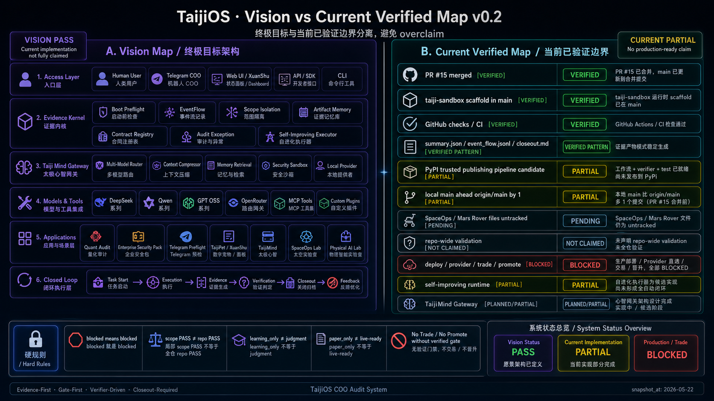

# TaijiOS System Architecture Vision

> This document is a product architecture vision map plus current verified boundary note.
> It does not claim production readiness, live provider readiness, trade readiness, or full self-improving runtime completion.



## Status

```text
diagram_scope=PASS
implementation_claim=PARTIAL
product_demo_value=HIGH
repo_wide_validation=NOT_CLAIMED
production_ready=NOT_CLAIMED
deploy_provider_trade_promote=BLOCKED
```

## What This Diagram Represents

This diagram shows the intended TaijiOS direction:

```text
AI Agent OS
Evidence Kernel
Gate-first execution
Verifier-first closeout
64 Hexagrams native architecture language
Long-term physical-world integration
```

The core operating chain is:

```text
Inputs -> Gates -> Evidence Kernel -> Verification -> Verdict -> Modes
```

The important distinction is:

```text
Vision Map != Current Production System
Current Verified Map != Repo-wide PASS
```

## Current Verified Boundaries

Current verified or partially verified areas include:

```text
PR #15 merged
taiji-sandbox scaffold in main
GitHub checks / CI pattern
summary.json / event_flow.jsonl / closeout.md pattern
Evidence-first workflow language
PASS / PARTIAL / BLOCKED / PENDING verdict language
No Trade / No Promote boundary
```

Current partial or pending areas include:

```text
PyPI trusted publishing pipeline candidate
Self-improving runtime
TaijiMind Gateway
SpaceOps / Mars Rover files
repo-wide validation
production deployment
provider/live readiness
```

Current blocked areas:

```text
deploy without explicit gate
external provider/live workflow without explicit gate
trade
paper-buy
promote
secret access
```

## Non-Overclaim Rules

Do not use this diagram to claim:

```text
All core systems are operational
Repo-wide validation has passed
Production deployment is ready
Live provider readiness is verified
Quant trading is enabled
Full self-improving runtime is complete
SpaceOps / Physical AI are implemented production systems
```

Allowed wording:

```text
TaijiOS is an evidence-first AI Agent runtime vision.
The current implementation has verified GitHub / evidence / closeout loops and partial runtime scaffolding.
Future modules are tracked as partial, candidate, planned, or blocked.
```

## Hard Rules Preserved

```text
blocked means blocked
scope PASS != repo PASS
learning_only != judgment
paper_only != live-ready
provider output != verified truth
No Trade / No Promote without verified gate
```

## Asset Integrity

```text
asset=docs/assets/taijios-vision-vs-current-v0.2.png
sha256=682e9a5d423392bf1f2128958ea5a5cb18c46c9bb2b0bc735a1bad7ceeb1d35c
source=generated_image_artifact_copied_from_codex_generated_images
```
